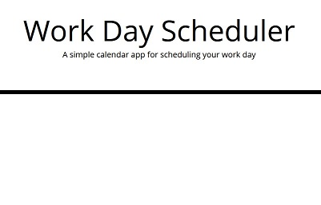
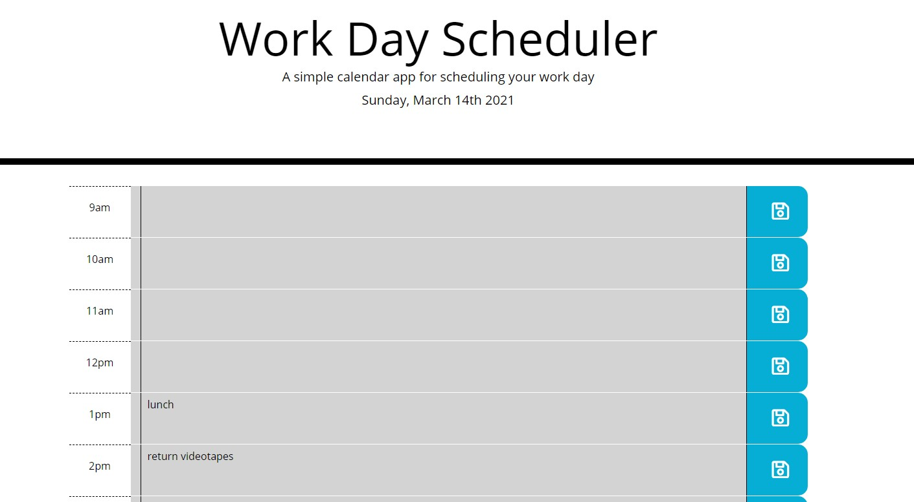

# Work Day Planner

**the assignment:** Build a planner web app that meets the following criteria
> GIVEN I am using a daily planner to create a schedule
> WHEN I open the planner
> THEN the current day is displayed at the top of the calendar
> WHEN I scroll down
> THEN I am presented with timeblocks for standard business hours
> WHEN I view the timeblocks for that day
> THEN each timeblock is color coded to indicate whether it is in the past, present, or future
> WHEN I click into a timeblock
> THEN I can enter an event
> WHEN I click the save button for that timeblock
> THEN the text for that event is saved in local storage
> WHEN I refresh the page
> THEN the saved events persist

Some basic HTML and CSS were provided, setting up links to Bootstrap, jQuery, Moment.js, Google Fonts, and Font Awesome.\

**the execution:**
- Built HTML skeleton for time-blocks using Bootstrap for layout and pre-written CSS for border styling
- Used Font Awesome for save icons
- Set up date display in header using Moment.js
- Used Moment.js to set a currentTime variable, and to populate the "hour" section of each time-block...
- ...which made it possible to compare those to the currentTime variable and use that information to set the color of each time-block with the prewritten CSS (though I wish the ".isBefore", ".isSame", and ".isAfter" functions for Moment worked, as they would have been super useful here)
- Set up save function with an event listener on the save icons using jQuery (which makes event delegation and DOM traversal so much easier)--when the save icon is clicked, the time and the input from the textbox are both grabbed and put into local storage
- Set up a function to automatically grab that info from local storage and populate the appropriate textarea with the scheduled event when the page loads 

https://artemissorrow.github.io/day-planner/
